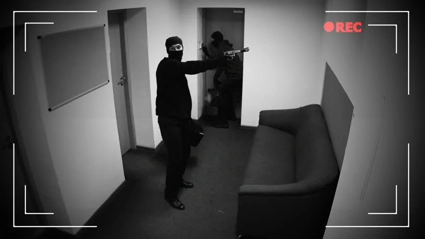
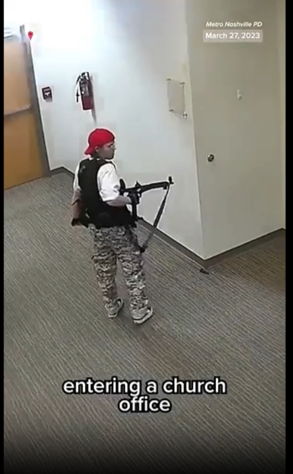
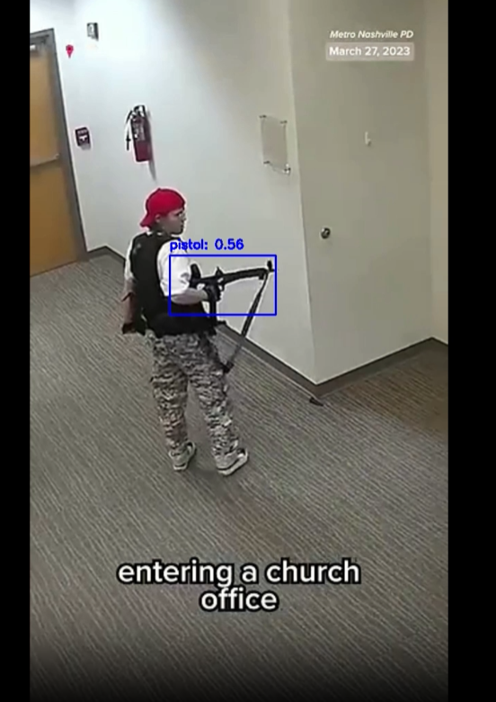

# YOLOv11: Обнаружение объектов

Этот проект представляет собой систему обнаружения объектов с использованием модели YOLOv11. Веб-интерфейс реализован с помощью **Streamlit**, а серверная часть — на **FastAPI**. 

## Установка

1. Клонируйте репозиторий:
   ```bash
   git clone <URL вашего репозитория>
   cd <папка проекта>
   ```

2. Установите зависимости:
   ```bash
   pip install -r requirements.txt
   ```

3. Создайте файл `.env` в корне проекта и укажите переменные окружения:
   ```
   HOST=0.0.0.0
   PORT=8001
   MODEL_PATH=best.pt
   HISTORY_FILE=request_history.json
   OUTPUT_DIR=outputs
   BACKEND_URL=http://localhost:8001
   ```

4. Убедитесь, что файл модели YOLO (`best.pt`) находится в корне проекта или в указанной директории.

## Запуск

### Сервер FastAPI
Для запуска серверной части выполните:
```bash
python fastapi_app.py
```

### Веб-интерфейс Streamlit
Для запуска веб-интерфейса выполните:
```bash
streamlit run streamlit_app.py
```

## Использование

### Веб-интерфейс
После запуска веб-интерфейса откройте браузер и перейдите по адресу `http://localhost:8501`. Вы увидите следующие разделы:

1. **Изображение**: Загрузка и обработка изображений. После обработки можно скачать результат.
2. **Видео**: Загрузка и обработка видео. Обработанное видео также доступно для скачивания.
3. **Камера**: Захват изображения с камеры и его обработка.
4. **Статистика**: Просмотр истории запросов, включая количество обработанных изображений и видео, среднее время обработки и расход памяти.
5. **Сгенерировать отчет**: Генерация отчета в формате PDF или Excel.

### Пример кода для API
Вы можете взаимодействовать с сервером FastAPI напрямую через API. Вот примеры запросов:

#### Обработка изображения
```python
import requests

url = "http://localhost:8001/process_image/"
files = {"file": open("example.jpg", "rb")}
response = requests.post(url, files=files)

if response.status_code == 200:
    with open("processed_example.jpg", "wb") as f:
        f.write(response.content)
    print("Обработанное изображение сохранено.")
else:
    print("Ошибка:", response.json())
```

#### Обработка видео
```python
import requests

url = "http://localhost:8001/process_video/"
files = {"file": open("example.mp4", "rb")}
response = requests.post(url, files=files)

if response.status_code == 200:
    with open("processed_example.mp4", "wb") as f:
        f.write(response.content)
    print("Обработанное видео сохранено.")
else:
    print("Ошибка:", response.json())
```

#### Получение истории запросов
```python
import requests

url = "http://localhost:8001/history/"
response = requests.get(url)

if response.status_code == 200:
    print("История запросов:", response.json())
else:
    print("Ошибка:", response.json())
```

#### Генерация отчета
```python
import requests

url = "http://localhost:8001/report/"
params = {"report_type": "pdf"}  # Или "excel"
response = requests.get(url, params=params)

if response.status_code == 200:
    with open("report.pdf", "wb") as f:
        f.write(response.content)
    print("Отчет сохранен.")
else:
    print("Ошибка:", response.json())
```

## Примечания

- Убедитесь, что модель YOLO поддерживает ваши данные. Для обучения модели используйте [Ultralytics YOLO](https://github.com/ultralytics/yolov5).
- Для работы с камерой убедитесь, что у вас есть доступ к устройству захвата.

## Пример веб-интерфейса

### Главная страница


### Обработка изображения


### Статистика


## Пример использования

### Пример 1: Обработка изображения
Исходное изображение:


Результат обработки:


### Пример 2: Обработка видео
Кадр из исходного видео:


Кадр из обработанного видео:


